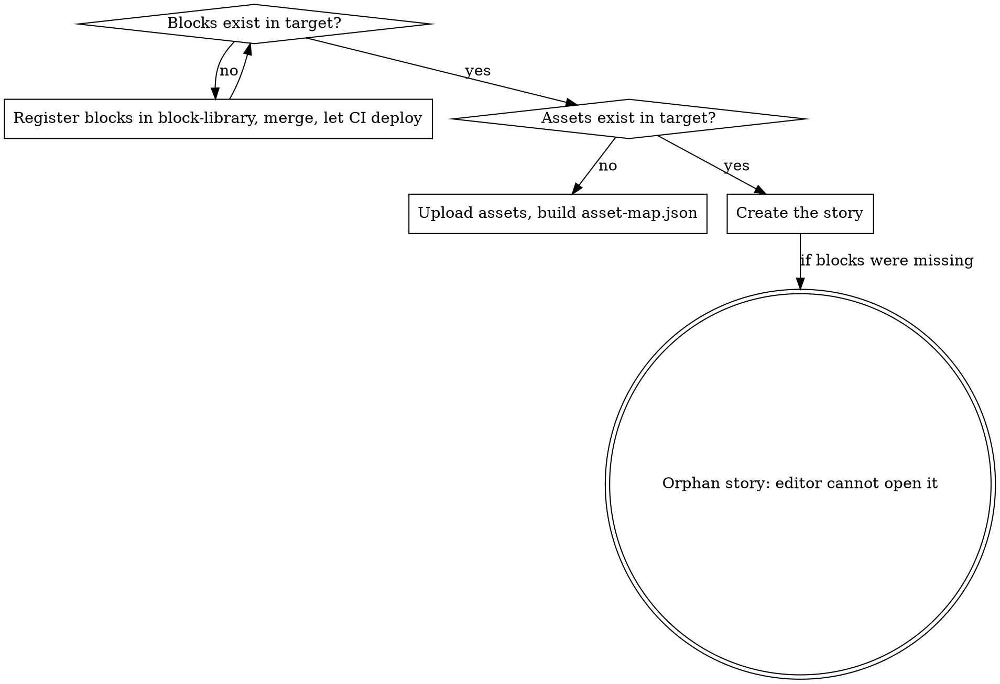

# Promote a Storyblok story from dev to production

Copies **one** story from the dev space to production over the Management API
(`curl` + `STORYBLOK_TOKEN`). No MCP required.

**Core principle: the schema travels through git, the content travels through the API.**
Components are registered in `block-library` and deployed by its CI. This skill
never creates a component — it refuses to run until the target space already has
every block the story uses.

## When to use

- A story was captured in dev and production still lacks it.
- New CMS copy must exist in both spaces before a feature ships.
- `Storyblok MCP` is not connected. **If it is**, prefer the MCP-based
  `storyblok-sync-stories` skill in `block-library/.agents/skills/`; it handles
  asset upload for you. This skill is the fallback and the trap reference.

Do **not** use it to migrate component schemas, to move a story between folders
(the token gets 403 on `parent_id` changes — copy and delete instead), or to
promote many stories in one shot. One story per run.

## The order that matters



Creating the story first still returns `200 OK` and stores the content intact.
The damage shows up in the editor: unknown blocks, nobody can edit the copy, and
saving from the UI risks mangling the nested content.

### "But the delivery API just returns JSON, so it will work"

Probably true, and it is still the wrong call. Storyblok stores content as JSON
and component schemas drive the editor, so a frontend reading the story may well
render fine. The reason to refuse is not that reads break:

- **Content becomes read-only for the people who own it.** Copy lives in the CMS
  so writers can change it without a deploy. An unregistered block takes that away
  and nobody notices until someone needs a fix.
- **Someone will open it and save.** That is when the nested content gets mangled,
  and the story you shipped is not the story in prod any more.
- **You are shipping an unreviewed schema.** The `block-library` MR is where field
  names, groups and `is_root` get checked. Skipping it means prod gets whatever
  shape you guessed, and the eventual CI upsert may not match it.
- **There is no clean rollback.** The fix is deleting the story and recreating it
  after the blocks land — that is the exact cleanup this skill exists to avoid.

If QA is blocked on a same-day deadline, unblock them **without writing to prod**:
point the app at the dev space, use the local CMS mock, or use a preview
deployment. Promote when the blocks are there.

## Quick reference

| Fact | Value |
|---|---|
| Management API host | `https://api-us.storyblok.com/v1` — **US cluster** |
| dev space | `1023897` |
| prod space | `567724046872094` |
| Token | `STORYBLOK_TOKEN` in `~/.zshrc` — `source ~/.zshrc` first |
| Token can | create/update/delete **stories** in both spaces |
| Token cannot | create **components** in prod (403), move a story between folders (403) |

## Workflow

```bash
cd konfio/skills/promote-storyblok-story/scripts
source ~/.zshrc            # STORYBLOK_TOKEN

# 1. Is the target ready? Fails loudly when it is not.
./preflight.sh 1023897 567724046872094 konfio-app-web/dashboard/solicitud/<slug>

# 2. Dry run: builds and prints the payload, writes nothing.
./promote.sh 1023897 567724046872094 konfio-app-web/dashboard/solicitud/<slug>

# 3. Apply (see "Writing to production" below).
./promote.sh 1023897 567724046872094 ... --asset-map map.json --publish --apply
```

`preflight.sh` checks, and blocks on, the four things that actually break a promotion:
every component the story uses exists in the target, the parent folder exists,
the slug is free, and which assets still point at the source CDN.

`MISSING in source` means the source space has no such story. Before assuming a
typo in the slug, check whether the content was ever captured in dev — a story
that was only ever built as a local mock does not exist in Storyblok at all.

`build-payload.py` rewrites everything that is space-scoped: `parent_id`, a fresh
`_uid` for every block, asset ids and filenames via `--asset-map`, and it drops
`component_group_uuid` and `internal_tag_ids`. Unmapped assets are a **hard error**,
not a warning.

## Writing to production

Claude Code's permission classifier blocks `POST` to the prod space. That is
working as intended. `promote.sh` without `--apply` prints the exact `curl` to run —
execute it yourself with a leading `!`:

```
! ./promote.sh 1023897 567724046872094 <slug> --asset-map map.json --publish --apply
```

## Verify with the API, never with the CLI

The `storyblok` CLI reports success it did not achieve. A real run printed
`Creating stories: 1/1 succeeded` and created **nothing** — the whole command had
failed on permissions. Always confirm against the Management API:

```bash
curl -sS -H "Authorization: $STORYBLOK_TOKEN" \
  "https://api-us.storyblok.com/v1/spaces/567724046872094/stories?starts_with=konfio-app-web/dashboard/solicitud/&per_page=100" \
  | python3 -c "import json,sys; [print(s['id'], s['slug']) for s in json.load(sys.stdin)['stories']]"
```

## Common mistakes

| Mistake | What happens | Do instead |
|---|---|---|
| Story before blocks | `200 OK`, but the editor shows unknown blocks and the copy is uneditable | Merge the `block-library` MR, wait for CI, then promote |
| `POST /components` to prod | `403 not allowed to execute this action` | Register in `block-library`; CI deploys via upsert by `name` |
| Reusing the dev asset URL | Filenames embed the space id (`/f/1023897/…`), so prod renders a broken image | Upload to target, pass `--asset-map` |
| Reusing `parent_id` or `component_group_uuid` | Wrong folder, or a 422 | Resolve them per space — `preflight.sh` does |
| Trusting HTTP 200 for "it exists" | Soft-deleted stories still answer 200 with `deleted_at` set | Check `deleted_at`, or list the folder |
| Trusting the CLI summary | Reports created stories it never created | Verify against the Management API |
| `is_root: false` on a content type | 422 `please select a content type component` | Page components need `is_root: true`, `is_nestable: false` |
| Renaming a component to "fix" a review | CI upserts by `name` — a rename creates a **second** component and orphans the story | Keep the name; argue the review comment instead |
| Promoting to unblock QA before the blocks land | Copy becomes uneditable in prod, and the cleanup is a delete + recreate | Point QA at dev, the CMS mock, or a preview deploy |

## Registering the blocks first

This skill stops when a component is missing. Registering it is `block-library`'s job:

1. Add the component JSON under `data/components/` — nestable blocks go in
   `molecules/`, page content types in `templates/konfio-app-web/<app>/` with a
   `-page` suffix.
2. Strip space-scoped metadata: numeric `id`, `created_at`, `component_group_uuid`,
   per-field `id`, `asset_folder_id`.
3. `pnpm validate:components`, then open the MR. CI deploys to both spaces.

See the `add-storyblok-component` skill in `block-library/.cursor/skills/` for the
full field-by-field rules.
